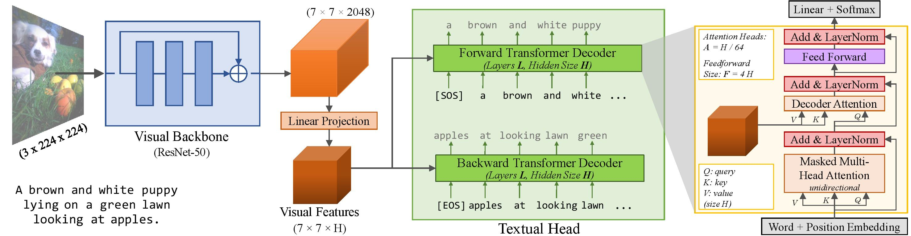

# ARCH pre-training: reproducing results from "Multiple Instance Captioning: Learning Representations From Histopathology Textbooks and Articles" [CVPR 2021]

### Disclaimer

This project heavily relies on two papers:
* **For Data and Training Decisions:** "Multiple Instance Captioning: Learning Representations From Histopathology Textbooks and Articles" [[CVPR'21 link](gamper2020multiple)]
* **For Code:** "VirTex: Learning Visual Representations from Textual Annotations" [[CVPR'21 link](virtex2020)]

Both of them were published in Proceedings of the IEEE/CVF Conference on Computer Vision and Pattern Recognition (CVPR), 2021. **Neither of these papers is my own work.**


[gamper2020multiple]: https://openaccess.thecvf.com/content/CVPR2021/html/Gamper_Multiple_Instance_Captioning_Learning_Representations_From_Histopathology_Textbooks_and_Articles_CVPR_2021_paper.html
[virtex2020]: https://openaccess.thecvf.com/content/CVPR2021/html/Desai_VirTex_Learning_Visual_Representations_From_Textual_Annotations_CVPR_2021_paper.html

### My Contributions

[README_ARCH.md](README_ARCH.md) describes what I did to reproduce the models from "Multiple Instance Captioning: Learning Representations From Histopathology Textbooks and Articles". I used a lot of the existing code from the [VirTex GitHub Repository](https://github.com/kdexd/virtex) and extended their codebase to accommodate for the changed nature of the dataset and annotations.

[README_ARCH_DATA.md](README_ARCH_DATA.md) outlines the contents of the ARCH dataset available on the web and how it differs from the version described in the paper.

### Acknowledgments

This project was made as part of the CDT (PhD) in Health Data Science.

**George Batchkala** is supported by Professor Fergus Gleeson’s A2 research funds and the EPSRC Center for Doctoral Training in Health Data Science (EP/S02428X/1).


----

## PRE-TRAINING DATA

**Jevgenij Gamper, Nasir Rajpoot**; Proceedings of the IEEE/CVF Conference on Computer Vision and Pattern Recognition (CVPR), 2021, pp. 16549-16559

**Abstract**

We present ARCH, a computational pathology (CP) multiple instance captioning dataset to facilitate dense supervision of CP tasks. Existing CP datasets focus on narrow tasks; ARCH on the other hand contains dense diagnostic and morphological descriptions for a range of stains, tissue types and pathologies. Using intrinsic dimensionality estimation, we show that ARCH is the only CP dataset to (ARCH-)rival its computer vision analog MS-COCO Captions. We conjecture that an encoder pre-trained on dense image captions learns transferable representations for most CP tasks. We support the conjecture with evidence that ARCH representation transfers to a variety of pathology sub-tasks better than ImageNet features or representations obtained via self-supervised or multi-task learning on pathology images alone. We release our best model and invite other researchers to test it on their CP tasks.

[[data](https://warwick.ac.uk/fac/cross_fac/tia/data/arch)] [[pdf](https://openaccess.thecvf.com/content/CVPR2021/papers/Gamper_Multiple_Instance_Captioning_Learning_Representations_From_Histopathology_Textbooks_and_Articles_CVPR_2021_paper.pdf)] [[supp](https://openaccess.thecvf.com/content/CVPR2021/supplemental/Gamper_Multiple_Instance_Captioning_CVPR_2021_supplemental.pdf)] [[arXiv](https://arxiv.org/abs/2103.05121)]

```text
@inproceedings{gamper2020multiple,
  title={Multiple Instance Captioning: Learning Representations from
Histopathology Textbooks and Articles},
  author={Gamper, Jevgenij and Rajpoot, Nasir},
  booktitle={Proceedings of the IEEE conference on computer vision and pattern recognition},
  year={2021}
}
```


----

## CODE

Forked from: https://github.com/kdexd/virtex

### VirTex: Learning Visual Representations from Textual Annotations

<h4>
Karan Desai and Justin Johnson
</br>
<span style="font-size: 14pt; color: #555555">
University of Michigan
</span>
</h4>
<hr>

**CVPR 2021** [arxiv.org/abs/2006.06666][1]

**Model Zoo, Usage Instructions and API docs:** [kdexd.github.io/virtex](https://kdexd.github.io/virtex)

VirTex is a pretraining approach which uses semantically dense captions to
learn visual representations. We train CNN + Transformers from scratch on
COCO Captions, and transfer the CNN to downstream vision tasks including
image classification, object detection, and instance segmentation.
VirTex matches or outperforms models which use ImageNet for pretraining --
both supervised or unsupervised -- despite using up to 10x fewer images.




Get the pretrained ResNet-50 visual backbone from our best performing VirTex
model in one line *without any installation*!

```python
import torch

# That's it, this one line only requires PyTorch.
model = torch.hub.load("kdexd/virtex", "resnet50", pretrained=True)
```

### Note (For returning users before January 2021):

The pretrained models in our model zoo have changed from [`v1.0`](https://github.com/kdexd/virtex/releases/tag/v1.0) onwards.
They are slightly better tuned than older models, and reproduce the results in our
CVPR 2021 accepted paper ([arXiv v2](https://arxiv.org/abs/2006.06666v2)).
Some training and evaluation hyperparams are changed since [`v0.9`](https://github.com/kdexd/virtex/releases/tag/v0.9).
Please refer [`CHANGELOG.md`](https://github.com/kdexd/virtex/blob/master/CHANGELOG.md)


### Usage Instructions

1. [How to setup this codebase?][2]  
2. [VirTex Model Zoo][3]  
3. [How to train your VirTex model?][4]  
4. [How to evaluate on downstream tasks?][5]  

Full documentation is available at [kdexd.github.io/virtex](https://kdexd.github.io/virtex).


### Citation

```text
@inproceedings{desai2021virtex,
    title={{VirTex: Learning Visual Representations from Textual Annotations}},
    author={Karan Desai and Justin Johnson},
    booktitle={CVPR},
    year={2021}
}
```


[1]: https://arxiv.org/abs/2006.06666
[2]: https://kdexd.github.io/virtex/virtex/usage/setup_dependencies.html
[3]: https://kdexd.github.io/virtex/virtex/usage/model_zoo.html
[4]: https://kdexd.github.io/virtex/virtex/usage/pretrain.html
[5]: https://kdexd.github.io/virtex/virtex/usage/downstream.html
